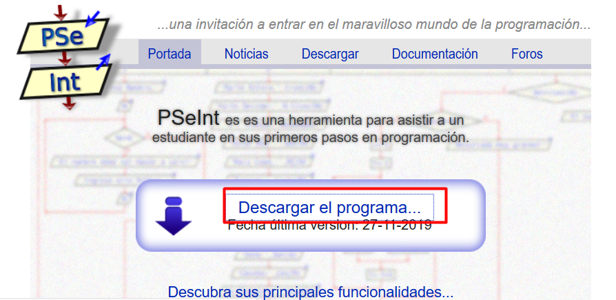
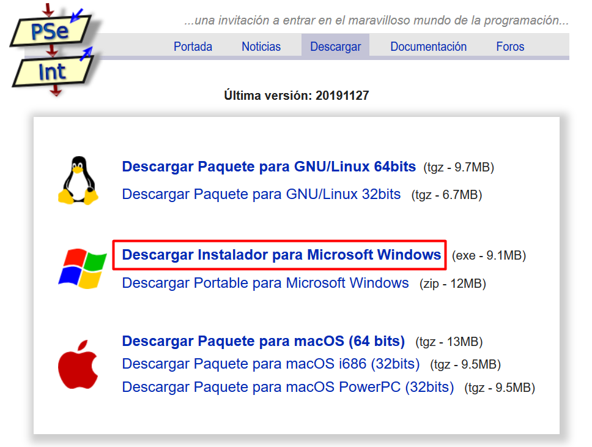
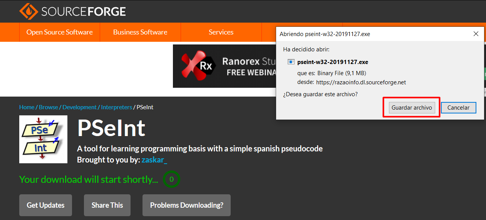
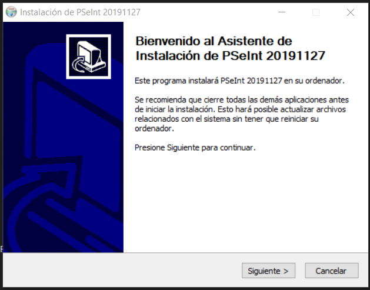
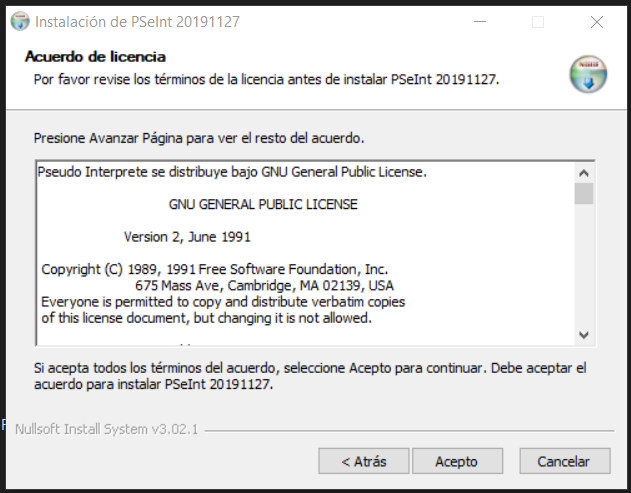
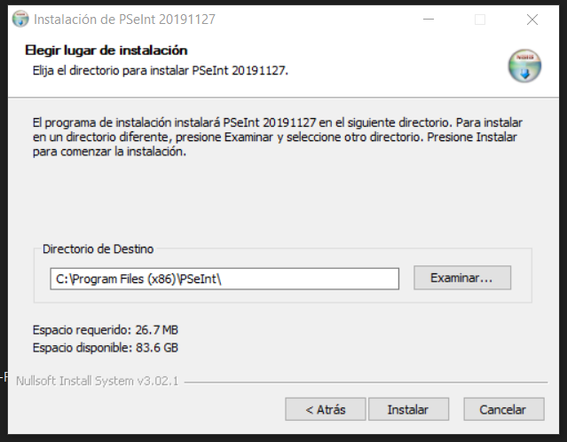
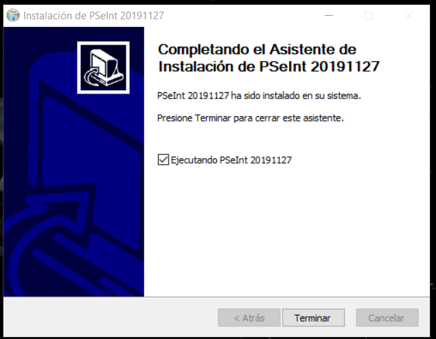
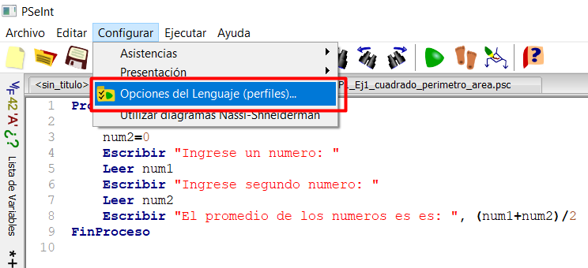
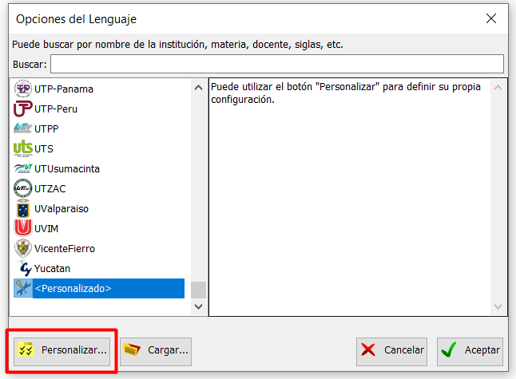
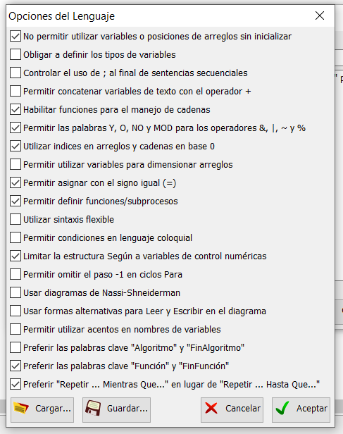

# Ejercicios_GTP
Resolucion de los ejercicios de la GTP

* TP1: Estructuras Secuenciales
* TP2: Estructuras Condicionales
* TP3: Estructuras Iterativas
* TP4: Programacion en C/C++
* TP5: Programacion Modular

## Instalación del PSeint
1. Ingrese a http://pseint.sourceforge.net/
2. Click en el enlace para descargar el programa

3. Seleccionar el link de descarga según el sistema operativo

4. Click en "guardar archivo"

5. Doble click al archivo descargado para iniciar la instalación

6. Aceptar los términos y condiciones

7. Seleccionar sitio donde se instalara (por defecto: C:\Program Files (x86)\PSeInt)

8. Presionar "Terminar". Dejar seleccionado por defecto 'Ejecutando PSeInt'

## Configurar PSeint
1. Abrir el PSeInt. En el menú principal, seleccionar "Configurar>Opciones del Lenguaje (perfiles)..."

2. Click en el botón "Personalizar..."

3. Seleccionar Opciones del Lenguaje
